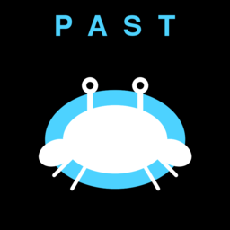

# Past Player Characters as Mobs

A BepInEx mod for *Everything is Crab*. Every 5 player levels (starting at level 20) the mod snapshots your build. In future runs, those past selves spawn as Alpha + Shiny mobs in the world, with the right stats, evolutions, and animations.

## Features

- Snapshots your evolution build every 5 levels after level 20. Persisted as JSON.
- Spawned ghosts are real Alpha + Shiny enemies. They inherit the snapshot's stats and visual build (sprites, animations, evolutions like horns, tail, claws, etc.).
- Uses the game's own SimulatedEvolutionHandler and VisualController pipeline. Zero side effects on the live player. No singleton issues, no achievement pollution, no stat leaks.
- Up to 200 snapshots per level bucket. When full, random eviction from the oldest half.
- On a winning run, all buffered snapshots persist. On a losing run, each is kept with configurable probability (default 25%).
- Configurable spawn chance, eligibility tolerance, stat scaling.

## Requirements

- *Everything is Crab* (tested 1.0.1__8213).
- BepInEx 6 BleedingEdge IL2CPP (CoreCLR), build 755 or newer. Stable Thunderstore BepInEx packs do not work on Unity 6.

## Install (manual)

1. Install BepInEx into your game folder. Launch the game once to generate `BepInEx/interop/`.
2. Download the latest zip from [Releases](../../releases).
3. Drop `plugins/Bungus-PastPlayerCharactersAsMobs/` from the zip into your `BepInEx/plugins/` folder.
4. Launch the game.

## Install (mod manager)

Use "Install from file" with the release zip in r2modman, Gale, or the Thunderstore App.

## Uninstall

Delete `BepInEx/plugins/Bungus-PastPlayerCharactersAsMobs/`. To also wipe saved snapshots, delete `BepInEx/config/com.bungus.everythingiscrab.pastplayercharactersasmobs/`.

## Config

`BepInEx/config/com.bungus.everythingiscrab.pastplayercharactersasmobs.cfg`:

- `MinLevel` (default 20): Start snapshotting once player reaches this level.
- `LevelsBetweenSnapshots` (default 5): Snapshot every N levels after MinLevel.
- `PerBucketCap` (default 200): Max snapshots per level bucket.
- `LossKeepChance` (default 0.25): On a non-winning run, per-snapshot keep probability.
- `EnableGhostSpawning` (default true): Master switch for spawning ghosts.
- `GhostSpawnChance` (default 0.005): Per regular enemy spawn, chance to promote to a past self.
- `GhostLevelTolerance` (default 2): Snapshot eligibility window around current player level.
- `ApplyGhostStats` (default true): Override ghost stats with the snapshot's values.
- `GhostStatScale` (default 1.0): Multiplier on transferred stats.
- `ShowGhostNotifications` (default false): IMGUI notification when a past self spawns.

## How it works

Snapshots capture the player's evolution picks (ability id, rarity, level), genetic, difficulty, affinities, specialisations, and stats. The on-disk file is a single JSON at `BepInEx/config/com.bungus.everythingiscrab.pastplayercharactersasmobs/snapshots.json` and you can inspect or wipe it freely.

At spawn time, the mod clones only the live player's `_visualController` GameObject (not PlayerCharacter), creates a `SimulatedEvolutionHandler`, replays the snapshot's evolutions into it, and wires it to the cloned VC via an injected `IVisualStatCharacter` shim. The game's own `RefreshVisuals()` then rebuilds the ghost from the simulated evolutions. This avoids instantiating a second PlayerCharacter (which throws "Multiple players found!") and avoids the side effects of the live `EvolutionHandler.ApplyEvolution` (achievements, PlayerStats writes).

## Credits

- Bungus
- Built with [BepInEx](https://github.com/BepInEx/BepInEx) and [HarmonyX](https://github.com/BepInEx/HarmonyX).

## Support

If you find this useful, you can buy me a coffee:

